# et-shop-uni-app

### 扫二维码申请【好酒仓库】体验
<!--  -->

<!--  -->

### 体验后端管理
关注公众号发送【好酒仓库】
后端源码需要付费，公众号咨询


 
好酒仓库小程序，基于uni-app、colorUi等开源组件开发

```
如果觉得对你有用，随手点个 🌟 Star 🌟 支持下，这样才有持续下去的动力，谢谢！～
```


[gitee https://gitee.com/xzjie/et-shop-uni-app.git](https://gitee.com/xzjie/et-shop-uni-app.git)

[github https://github.com/myxzjie/et-shop-uni-app.git](https://github.com/myxzjie/et-shop-uni-app.git)


### 项目状态
1. 好酒仓库小程序-持续更新
> * 有bug、功能点问题，请提issues
> * 功能不完善或不合理、功能意见，请联系我
> * 如果有项目需求、设计需求、其他方面合作，可以联系我～

### 项目说明

1.  项目基于uniApp，使用colorUi、uiview开发. 感谢各位大佬～. 
2.  项目功能：
> * 自定义TabBar与顶部
> * banner轮播
> * 通知公告
> * 酒品分类
> * 发现/文章
> * 购物车
> * 个人中心
> * 促销功能(新品，推荐，热销、促销)
> * 签到
> * 团购
> * 秒杀
> * 砍价
> * 收藏
> * 积分
> * 优惠卷
> * 分销/佣金
> * 我的余额
> * 推广二维码
> * 小程序分享等等...
> 


## 安装教程
使用工具nodejs，HBuilderX，微信开发工具。
```
npm install
```

### 启动项目
HBuilderX自己调微信开发工具。

### 后端使用技术框架

| 核心技术 | 版本 |
|---|---|
| spring boot | 2.4.0 |
| spring security | 2.4.0 |
| quartz | 2.3.2 |
| jpa | 2.4.0 |
| mybatis | 3.2.x |
| mysql | 8.0.x |
| redis | 6.0.x |
| minio | - |
| aliyun oss | - |
| vue | 2.6.x |
| element-ui | - |


### 好酒仓库商城
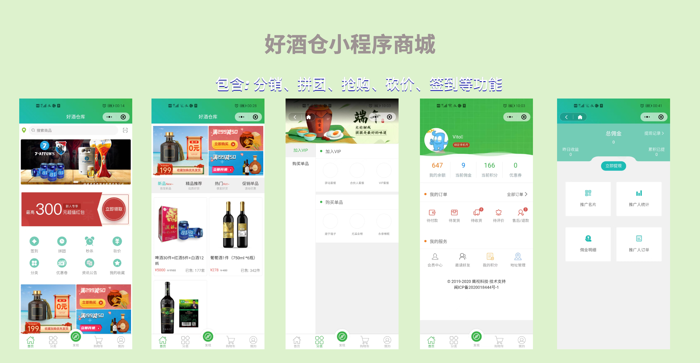

### 后台管理

#### 后台登录


#### 后台首页
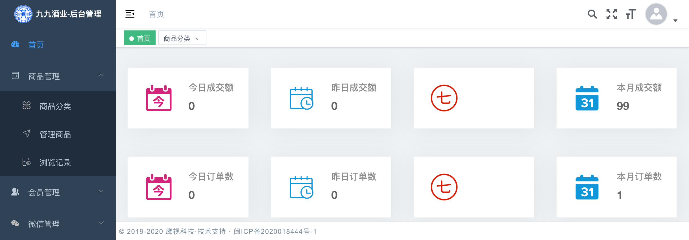

#### 商品分类
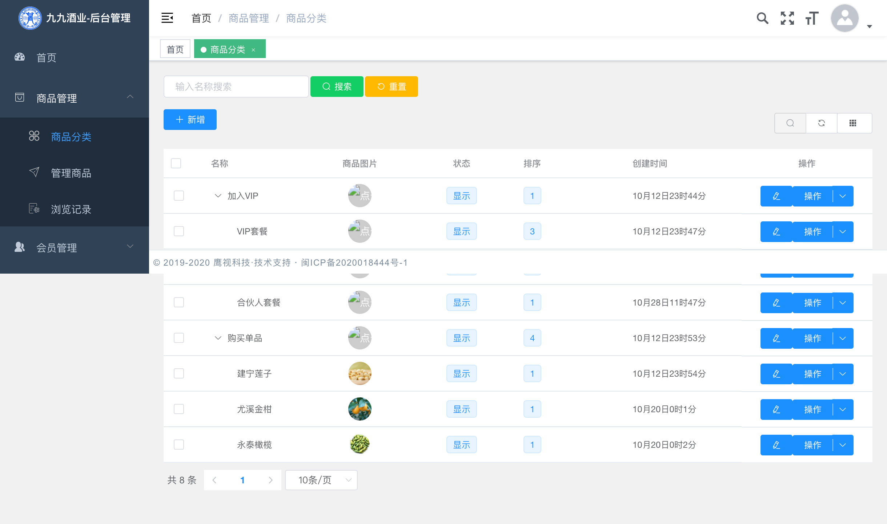

#### 酒商品
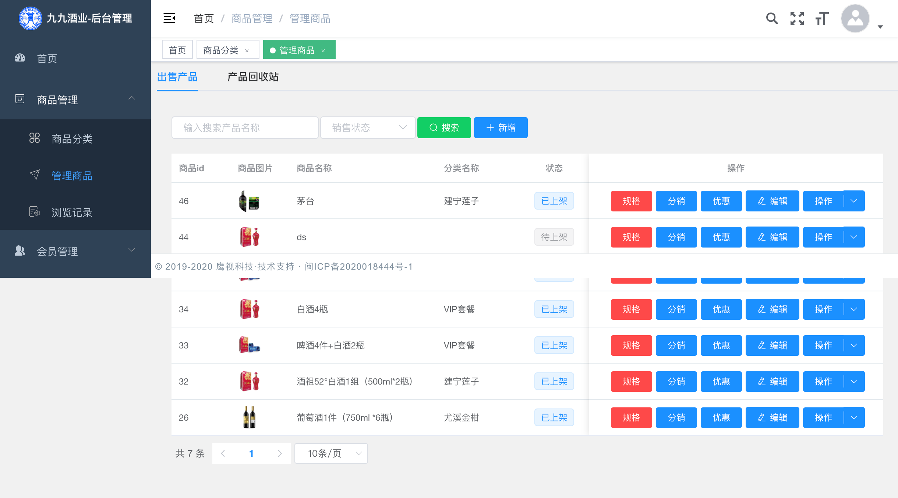

#### 会员
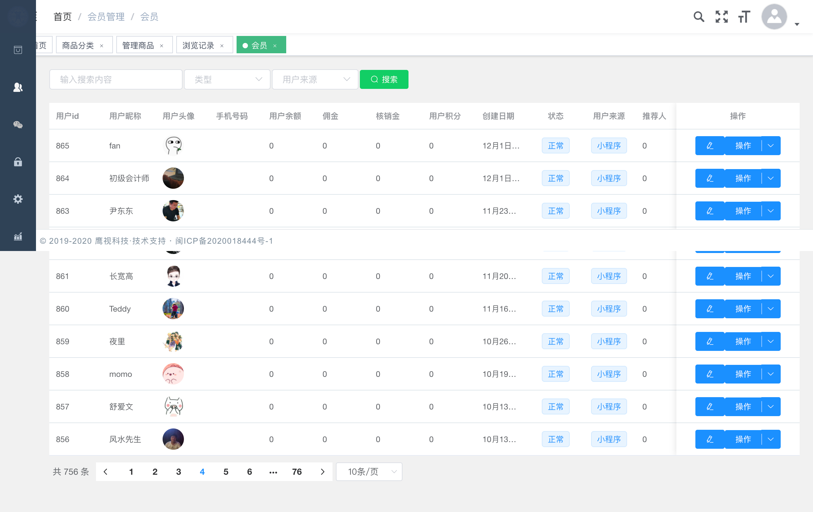

#### 等级
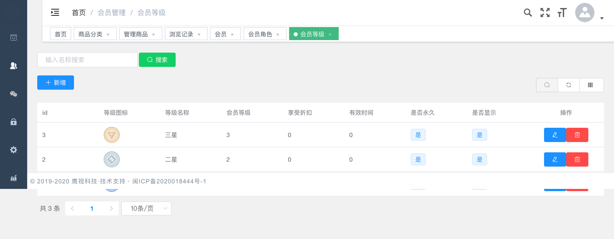

#### 等级任务
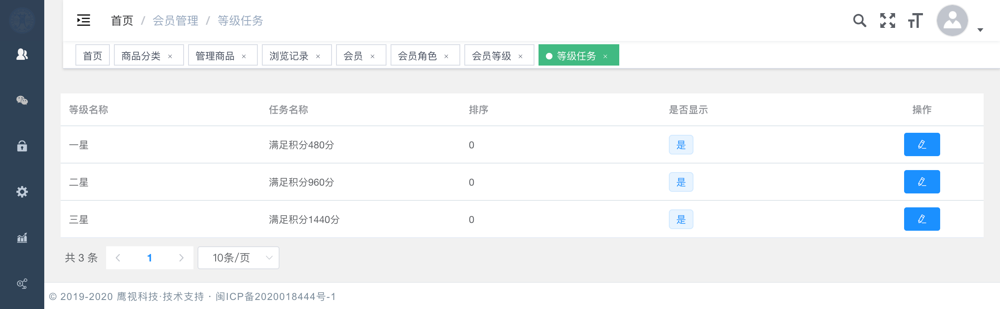

#### 用户账单
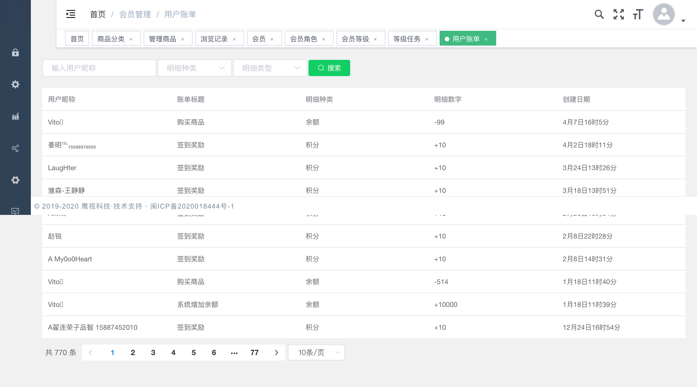

<!--  -->
<!-- 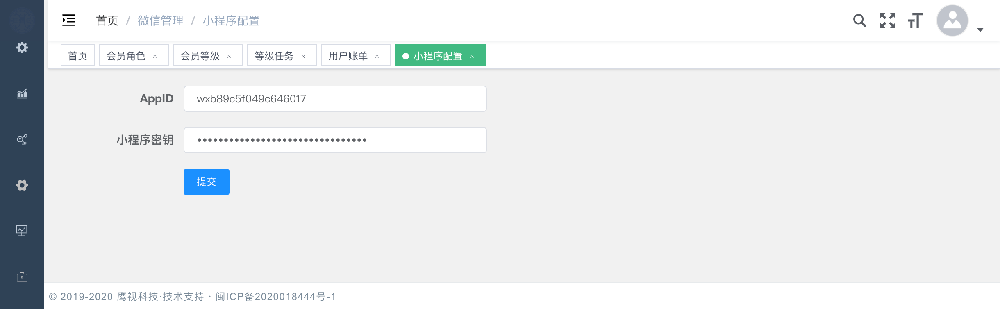 -->

#### 商品评论
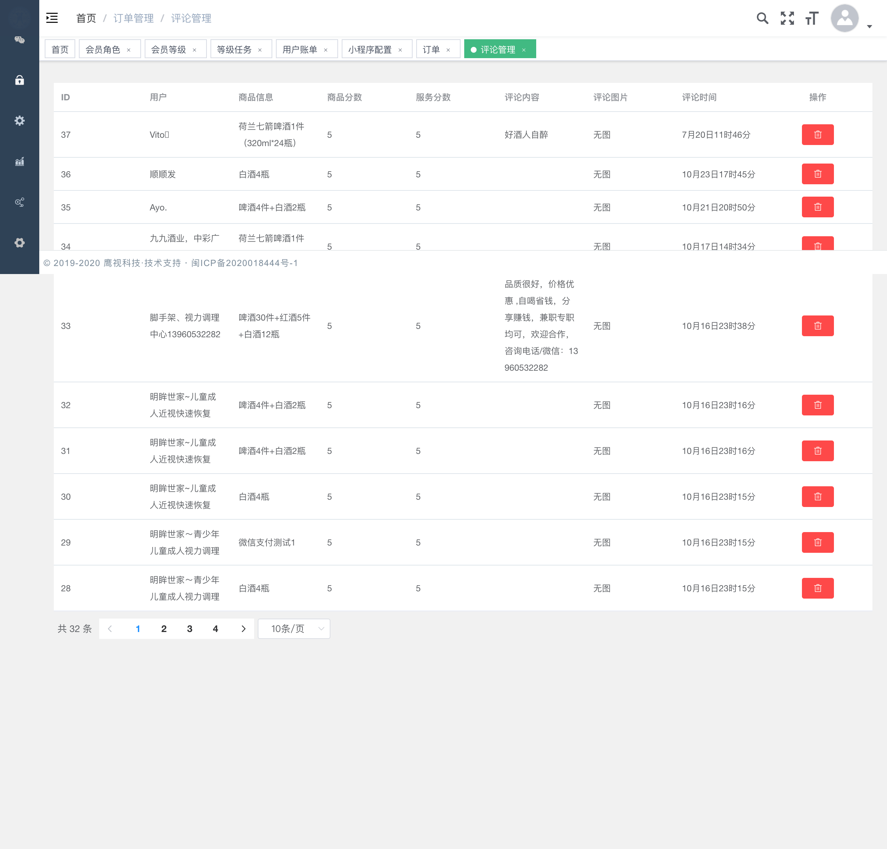

#### 店铺装修
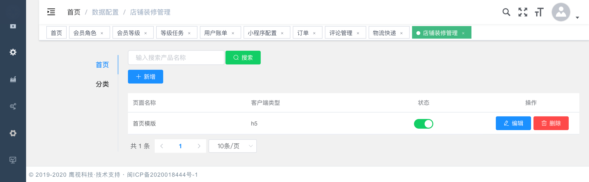

#### 首页装修
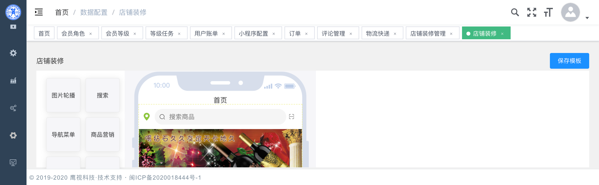

#### 优惠卷
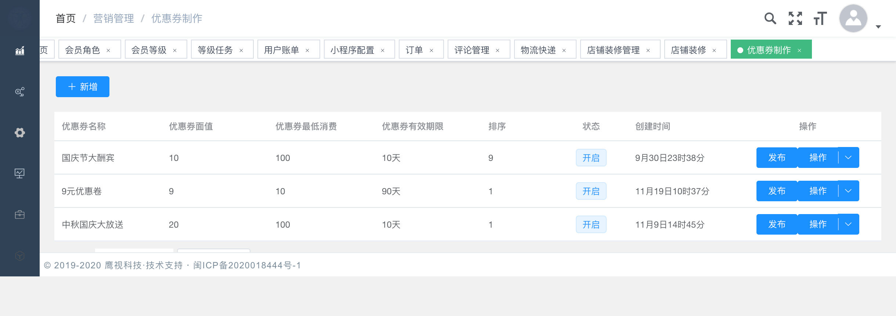

### 项目信息

1.  作者：vito
2.  QQ: 513961835
3.  WX: myxzjie


### 交流群
2.  QQ群: 203498970


### 其他说明
> *  

### 赞助作者
> *  打赏就点点🌟 Star 🌟 关注更新，支持下作者就可以了

